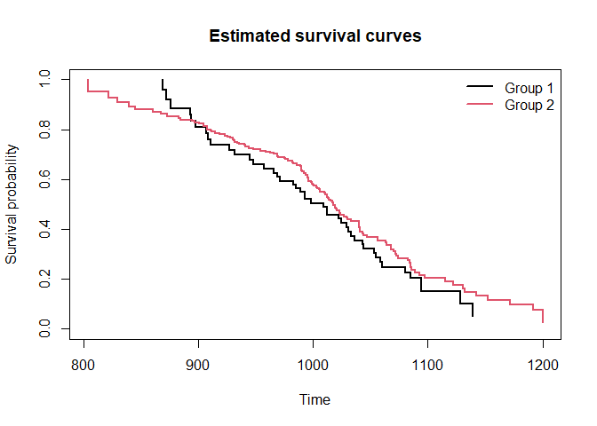

<!-- README.md is generated from README.Rmd. Please edit that file -->

# ksamplesLTRC

<!-- badges: start -->

<!-- badges: end -->

ksamplesLTRC provides nonparametric k-sample tests for comparing
distributions under left truncation and/or right censoring. It
implements Kolmogorov–Smirnov-type, Cramér–von Mises-type, and weighted
log-rank statistics, with bootstrap-based p-value approximation, for one
or more independent samples of possibly truncated and/or censored
survival data.

## Installation

You can install ksamplesLTRC from CRAN with:

``` r
install.packages("ksamplesLTRC")
```

## Example

A basic k-sample comparison under left truncation and right censoring,
using the well-known `channing` dataset from the `KMsurv` package:

``` r
library(ksamplesLTRC)
library(KMsurv)
data(channing)

data.channing <- data.frame(channing$ageentry, 
                            channing$age,
                            channing$death, 
                            channing$gender)

aa <- ltrc.test(data.channing,
                holes='conditional',
                tests=c('ks','cvm','logrank'),
                B = 200,
                p=c(0,1,0.5,0),
                q=c(0,0,0.5,1))
plot(aa)
```



``` r
summary(aa)
#>           Test Statistic    p.value
#> 1           KS 1.4460553 0.71641791
#> 2          CvM 0.2785837 0.75621891
#> 3     p=0, q=0 2.2850754 0.13062379
#> 4     p=1, q=0 2.8141049 0.09343901
#> 5 p=0.5, q=0.5 1.8900577 0.16919541
#> 6     p=0, q=1 1.1779684 0.27776998
```
